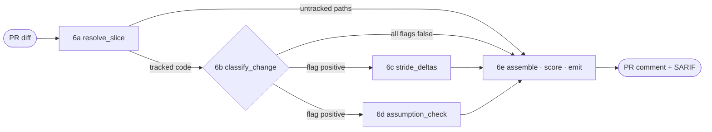

<div align="center">

# 🛡️ Threat-Model Delta

**Review every pull request as a _delta_ against a human-authored threat model —
not a whole-system model rebuilt from scratch on every push.**

[](https://github.com/Devko/pipeThreat/actions/workflows/ci.yml)
&nbsp;
&nbsp;
&nbsp;
&nbsp;

</div>

Most "LLM threat modeling" fails because it asks a model to threat-model an entire
codebase on every push: unbounded, irreproducible, and far beyond a small local
model. **This does the opposite.** A human writes a threat-model baseline once; each
PR is then judged only on the small intersection between the diff and the relevant
slice of that baseline:

> **Does this change add an entry point, cross a trust boundary, expose an asset
> differently, or break a stated security assumption?**

Deterministic code does the breadth (path mapping, severity, dedup, gating); a
small local LLM answers narrow, single-purpose questions over tiny inputs. The
result is **non-blocking** — it posts a PR comment + SARIF and never fails the
build. Severity is computed from facts, so it is stable across runs.

### What it posts on your PR

```text
## Threat-Model Delta (advisory)

### High (1)
- new_entry_point — affected: comp.user_service  ⚠ needs human review
  - Change signals: new entry point, trust-boundary crossing
  - STRIDE: InformationDisclosure, ElevationOfPrivilege
  - Confidence: high
  - Why high: new entry point on an internal component → High
  - New public HTTP handler on an internal service returns user PII without authz.
  - Recommended action: route through the gateway or add explicit authz + validation.
```

Each finding folds a component's change-signals into one line (not one near-duplicate
per signal), states _why_ the severity is what it is, and reports a confidence that
means something — `high` only when an independent static-analysis signal corroborates
the model. Multiple assumptions broken by the _same_ change are grouped under one root
cause, so a reviewer reads one issue with its consequences instead of a wall of
look-alikes (the deltas stay separate in SARIF for tracking).

---

## 🔍 How it works



| Stage | Does | Kind |
|---|---|---|
| **6a** `resolve_slice` | Match changed paths to baseline `code_paths`; build the relevant slice; flag untracked paths | deterministic |
| **6b** `classify_change` | Coarse flags — is a new entry point / data flow / boundary crossing / asset change / control change plausibly in play? | LLM · voted |
| **6c** `stride_deltas` | Per affected component: which STRIDE categories does _this_ change introduce or worsen? Grounded with deterministic signals | LLM · per component |
| **6d** `assumption_check` | Which stated assumptions does the diff violate or weaken? **One bounded call per assumption** (small models drop items when batched) | LLM · per assumption |
| **6e** assemble + score + emit | Collapse each component's signals into one scored delta; group its assumption violations under one root cause; dedupe; render SARIF + PR comment | deterministic |

6b **gates** 6c and 6d: if every flag is false, the expensive calls are skipped and
only deterministic `untracked_path` deltas remain. A typical PR is a handful of
short, bounded calls (one classify, one per affected component, one per assumption)
— async, so it never holds up the merge.

### Signal quality

Four deterministic mechanisms keep the small-model output trustworthy:

- **Deterministic signals** — before 6c/6d, the pipeline scans the added lines and the
  static-analysis annotations for grounding facts (entry points, untrusted input →
  sink reach, missing auth/rate-limit/validation) and hands them to the model as data.
  It judges facts, it doesn't imagine threats.
- **Per-assumption fan-out** — 6d asks one narrow yes/no question per assumption.
  Batching the whole list into one prompt is what makes small models silently drop
  violations.
- **Self-consistency voting** (`--votes N`, off by default) — sample each call N times
  and keep only what a majority agrees on; the agreement fraction feeds confidence.
- **Meaningful confidence** — `high` only when an independent static-analysis signal
  corroborates a confident finding; `low` on a split vote or model uncertainty.
  Severity stays deterministic regardless.

`--since <deltas.json>` runs incrementally: a re-run on the same PR suppresses deltas
already reported and surfaces only what changed.

---

## 🚀 Quick start

### As a GitHub Action

Add `threat-model.yaml` to your repo root, then:

```yaml
# .github/workflows/threat-model-delta.yml
name: threat-model-delta
on: pull_request
permissions: { contents: read, pull-requests: write, security-events: write }
jobs:
  threat-delta:
    runs-on: ubuntu-latest
    continue-on-error: true              # advisory — never block the merge
    steps:
      - uses: actions/checkout@v4
        with: { fetch-depth: 0 }         # needed to compute the PR diff
      - id: delta
        uses: Devko/pipeThreat@main      # or pin a tag, e.g. @v0.1.0
        with:
          baseline: threat-model.yaml
          llm: ollama                     # provision a local model on the runner
      - if: always()
        uses: github/codeql-action/upload-sarif@v3
        with:
          sarif_file: ${{ steps.delta.outputs.sarif }}
          category: threat-model-delta
```

### As a library

```python
from threat_delta import run_step, build_client, needs_human_review

result = run_step(
    baseline="threat-model.yaml",   # path or Baseline
    diff="pr.diff",                 # path or Diff
    annotations="annotations.json", # optional
    pr="1234",
    llm=build_client("ollama"),     # required — no silent default; omitting it raises
)

result.deltas              # list[Delta]
result.sarif               # SARIF 2.1.0 dict
result.comment             # PR-comment markdown
needs_human_review(result) # high-severity deltas for the optional gate
```

`run_step` takes a path **or** an in-memory object for every input and is the one
integration seam — the CLI and the Action are thin wrappers over it.

### As a CLI

```bash
pip install "git+https://github.com/Devko/pipeThreat@main"

threat-delta analyze \
  --baseline threat-model.yaml \
  --diff pr.diff \
  --pr 1234 \
  --llm ollama \
  --sarif threat-delta.sarif \
  --comment threat-delta.md
```

`--llm` is **required** — there is no silent default, so a run without a model errors
instead of fabricating an empty "no deltas" result. Otherwise exits `0` regardless of
findings. `--fail-on-high` exits non-zero when a high-severity delta needs human
review — pair it with a `security/needs-review` label and branch protection for a
_human_ gate (never a model gate).

---

## 🧠 Choosing a model

Three transports ship in `threat_delta.transports` (standard library only). `--llm` is
required — there is no default, so a real model is a conscious choice:

| `--llm` | Client | Target |
|---|---|---|
| `ollama` | `OllamaClient` | a local Ollama server (`gemma4:e2b`) |
| `openai` | `OpenAICompatibleClient` | any OpenAI-compatible endpoint (llama.cpp, vLLM, LM Studio) |
| `stub` | offline — reports nothing | dry-run / testing only |

**Recommended: `gemma4:e2b` with reasoning on** (the defaults). Measured on a CPU-only
`ubuntu-latest` runner against the [Synapse example](examples/synapse/):

| model · mode | STRIDE | assumption checks | time |
|---|---|---|---|
| `gemma4:e4b` · no-think | InformationDisclosure | — | ~3 min |
| `gemma4:e4b` · reasoning | lost in chain-of-thought | ✓ ✓ | ~13 min |
| **`gemma4:e2b` · reasoning** | **InfoDisclosure + ElevationOfPrivilege** | **✓ ✓** | **~4 min** |

The smaller "effective-2B" model thinks fast enough on CPU that bounded reasoning is
affordable, giving the richest signal quickly. Reasoning is on by default; `--no-think`
disables it for a heavier model.

Reasoning is **bounded** (`temperature=0`, per-stage token budgets in
`LLMConfig.stage_reasoning_budgets`). `OllamaClient` uses Ollama's native `/api/chat`
endpoint, which honors the `think` flag (the OpenAI `/v1` shim does not).

---

## 📋 The baseline

`threat-model.yaml` is human-authored, version-controlled, and reviewed like source.
The link to code is `code_paths` — globs (with `**`) that map each component to its
source, so a diff resolves to the elements it affects. See
[`examples/threat-model.yaml`](examples/threat-model.yaml).

When a PR touches code no component claims, 6a emits an `untracked_path` delta with a
proposed baseline update; accepting it keeps the baseline in step with the code.

Three deterministic helpers (no LLM) bootstrap and maintain it:

```bash
threat-delta init . --out threat-model.yaml          # scaffold from the repo layout
threat-delta validate --baseline threat-model.yaml   # referential-integrity check (run in CI)
threat-delta coverage --baseline threat-model.yaml . # which source paths nothing covers
```

`threat-delta init --llm ollama` can draft the first baseline with model assistance:
deterministic code discovers the components and `code_paths`, the model fills the
judgment fields, and the output is labelled `DRAFT — HUMAN REVIEW REQUIRED`. It is a
one-time, offline bootstrap — review and commit it.

---

## 📂 Worked examples

Three end-to-end runs against real open-source projects, in three languages
(deterministic, generated with a scripted model — each has a `generate_report.py` you
can re-run, or run live with `--llm ollama`):

| Example | Language | The PR | STRIDE surfaced |
|---|---|---|---|
| [Matrix Synapse](examples/synapse/) | 🐍 Python | Client endpoint returns any user's account data, no auth | InfoDisclosure · ElevationOfPrivilege · Spoofing |
| [HashiCorp Vault](examples/vault/) | 🐹 Go | Debug endpoint returns raw secrets from storage, bypassing token/ACL/audit | InfoDisclosure · ElevationOfPrivilege · **Repudiation** |
| [n8n](examples/n8n/) | 🟦 TypeScript | Unauthenticated public webhook executes workflows | **Spoofing · Tampering · DenialOfService** · ElevationOfPrivilege |

Each explains _why a change matters at the system level_ — not just "missing auth
check" — and maps it to violated assumptions with deterministic severity (the n8n
example shows tiered High + Medium in one report). The same machinery resolves
`code_paths` in each language with no per-language logic.

---

## 🔒 Design guarantees

- **Bounded context** — only the baseline slice, diff summary, and annotations reach
  the model; never the whole repo or whole baseline.
- **Deterministic severity** — computed from facts (asset sensitivity, trust zone),
  stable across runs. The model supplies inputs; rules assign the level.
- **Hallucination-guarded** — deltas referencing unknown ids are dropped; invalid
  STRIDE labels and unknown assumption ids are filtered.
- **Injection-resistant** — diff and comment text is passed as data under labelled
  sections, never as instructions.
- **Anchored output** — SARIF results carry the changed-line region, so findings land
  as inline annotations on the PR diff, not just file-level.

---

## 🗂️ Project layout

<details>
<summary>Package structure (click to expand)</summary>

```
action.yml              composite GitHub Action
threat_delta/
  models.py             shared dataclasses — the contract between stages
  baseline.py           load + index threat-model.yaml
  diff.py               parse diffs, annotations, findings
  relevance.py          6a — glob path matching → baseline slice
  signals.py            deterministic grounding facts + hunk regions
  prompts.py            prompt templates (data-only, injection-resistant)
  classify.py           6b — change classification
  stride.py             6c — STRIDE deltas
  assumptions.py        6d — assumption violations
  severity.py           deterministic severity rules
  emit.py               6e — SARIF 2.1.0 + PR comment
  pipeline.py           orchestration + delta assembly
  step.py               run_step() — the standalone entry point
  llm.py                LLM client contract + offline stub + JSON recovery
  transports.py         Ollama / OpenAI-compatible clients (stdlib only)
  scaffold.py           init — scaffold a baseline from the repo layout
  scaffold_llm.py       init --llm — LLM-assisted baseline draft
  validate.py           validate — referential-integrity checks
  coverage.py           coverage — source paths no component covers
  cli.py                analyze / init / validate / coverage
examples/               baseline + worked-example PR inputs
tests/                  pytest suite (every stage + end-to-end)
```

</details>

## 🛠️ Development

```bash
pip install -e '.[dev]'
python -m pytest -q
```

<div align="center"><sub>Advisory by design · deterministic severity · bring your own local model</sub></div>
